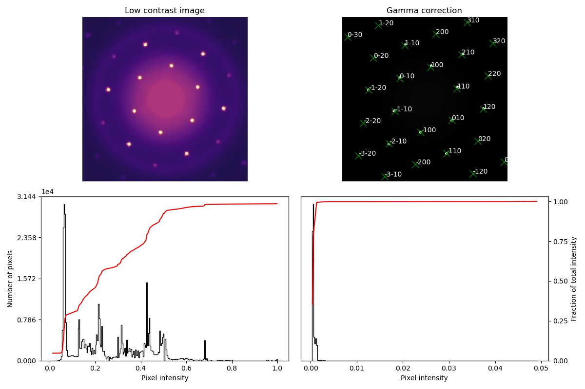

# Peakfinding
This repository generates points in a reciprocal lattice and matches them to peaks autodetected in an image.
Images are automatically gamma corrrected to assist in peak identification. 'Black and White' 
images, or ndarray ([M[, N[, ...P]][, 1]), are automatically gamma corrected but require a different function which 
doesn't collapse multiple channels. 

Below shows the test suite on an RGB diffraction set. Top left panel illustrates the original image (*.jpg), and plotted below is histogram and CDF of pixel intensities. Top right is the gamma corrected image, where the image has now become binary (peaks ~ 1, else ~ 0), as seen by the histogram and CDF of pixel intensities given below. The peaks in the gamma corrected image are assigned Miller indices corresponding to the reciprocal lattice generated by (default) the two peaks
closest to the centroid of the diffraction pattern. User can also specify the (real) unit cell parameters, namely side lengths \\((a, b, c)\\) and relative angles \\((\alpha, \beta, \gamma)\\) to determine the reciprocal lattice based on
experiment-specific parameters. Upcoming development will ensure lattice generated by these parameters will be robust.
